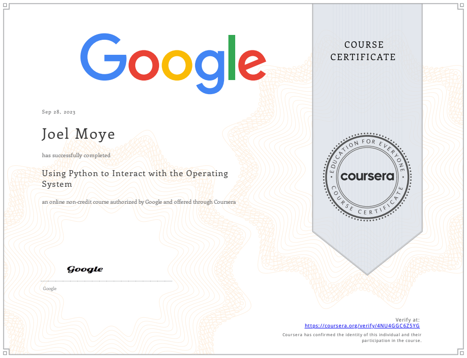

## [Back to Coursera Courses](/README.md)
### [Using Python to Interact with the Operating System](https://www.coursera.org/learn/python-operating-system)
[Verify or Download Certificate](https://coursera.org/verify/4NU4GGC6Z5YG)

